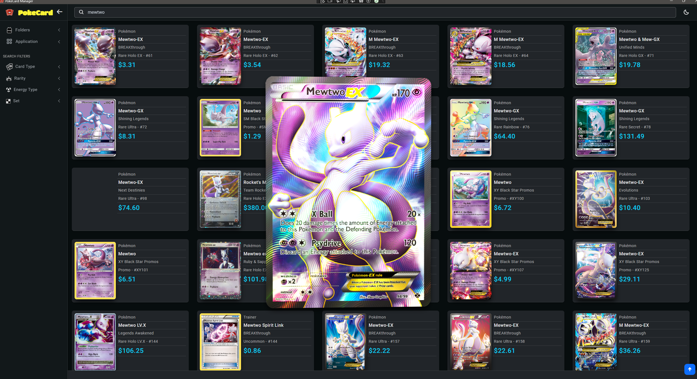

# PokeCard -- [ Pokemon Card Manager ]

**An application to manage your Pokemon cards collection.**
 - Keep record of the cards currently own and categorize them how you want
 - Keep track of their value and chart the price history
 - Build lists of cards you want to get and set up alerts for price changes
 - Quickly search for cards using a variety of filters or browse by categories or sets

 Built using: **`C#`**, **`.NET 7.0`**, **`Cefsharp`**, **`SQLite`**, **`Blazor Hybrid`**, **`ASP.NET`**    
 [Pokemon Cards V2 css](https://poke-holo.simey.me/)  and the [Pokemon TCG API](https://pokemontcg.io/).

 ---

(*Still an early work in progress.*)